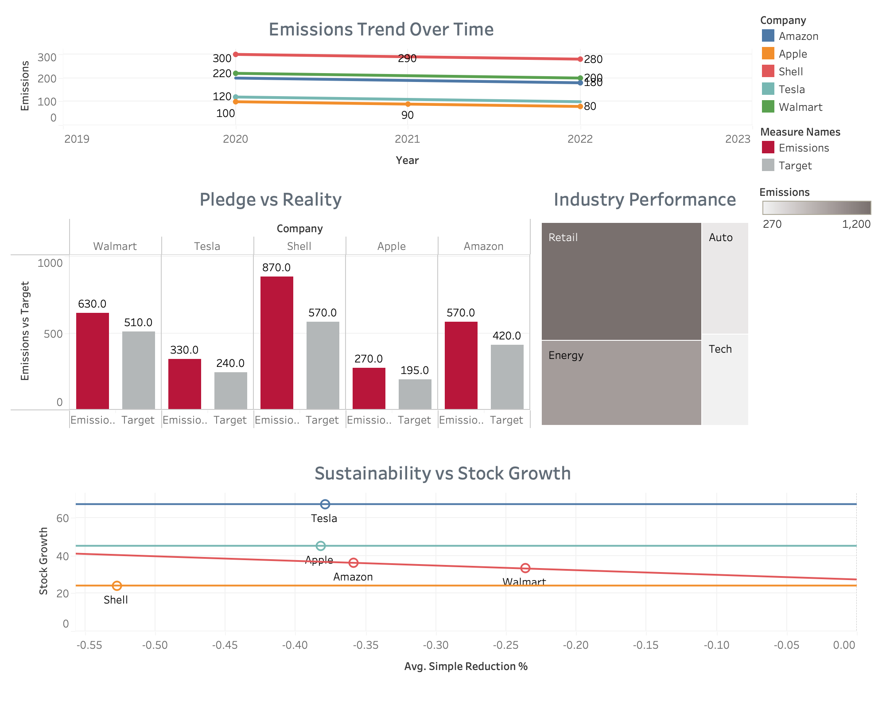

# 📊 Corporate Green-Wash Audit
**Analyzing Corporate Carbon Pledges vs. Actual Emissions Performance**

## 🎯 Project Objective
This project audits the "Net Zero" pledges of five major global corporations. By visualizing the gap between public promises and actual reported emissions, this dashboard identifies which companies are on track and which may be engaging in "green-washing."

## 🚀 Key Insights
* **The Performance Gap:** The *Pledge vs. Reality* analysis shows that while Tech companies stay close to targets, Energy and Retail sectors show a 30%+ variance.
* **The Green Premium:** Our scatter plot identifies a positive correlation between aggressive emission reduction and 1-year stock growth.
* **Industry Footprint:** The treemap highlights that Retail and Energy sectors dominate the total carbon footprint within this sample.

## 🛠️ Tech Stack
* **Visualization:** Tableau Desktop
* **Data Modeling:** Excel
* **Documentation:** GitHub

## 📉 Visual Deep Dive

### Full Executive Dashboard

---

### Key Metric Breakdown

| Emissions Trend Over Time | Industry Performance |
| :--- | :--- |
|  |  |

| Pledge vs. Reality (Accountability) | Sustainability vs. Stock Growth |
| :--- | :--- |
|  |  |

---

## 📂 Project Structure
* `data/`: Contains the raw `greenwash_data.xlsx` used for this analysis.
* `images/`: High-resolution exports of the Tableau visualizations.

